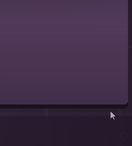
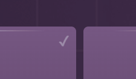
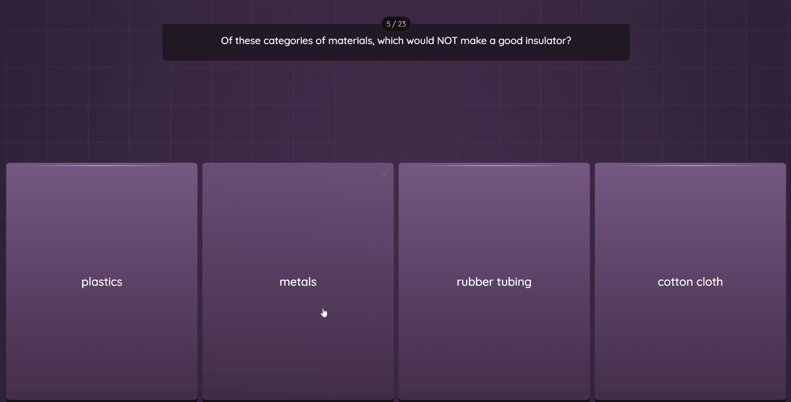

# 🚀 Wayground & Quizizz Cheat

  
  
  

**Wayground Cheat** is a high-performance userscript designed to enhance the experience on learning platforms. It focuses on intelligent automation and user privacy protection by intercepting and blocking network logs.

---

## ✨ Key Features

* **🤖 Auto-Solver:** Real-time answer retrieval for Quizizz and Wayground.
* **🛡️ Anti-Log System:** Blocks platform tracking requests to prevent unusual activity logs.
* **🎨 Minimalist UI:** Integrated floating panel with native dark mode, designed for zero-distraction.
* **⚡ Optimized Performance:** Lightweight Vanilla JavaScript core to ensure zero latency.

---

## 🛠️ Compatibility & Supported Questions

To maintain high accuracy, the script currently focuses on the most common question formats:

* ✅ **MCQ (Multiple Choice Questions):** Highlights the correct option instantly.
* ✅ **BLANK (Fill in the Blanks):** Displays the exact text required in the panel.
* ⚠️ *Other formats (Reorder, Match, etc.) are currently not supported to ensure stealth stability.*

---

## 📸 Screenshots & Demos

| Panel Interface | In-Game Answers | Blocked Logs |
| :---: | :---: | :---: |
|  |  |  |

| In-Game Answers Interface |
| :---: |
|  |
---

## 🚀 Installation

1. Install the [Tampermonkey](https://www.tampermonkey.net/) extension for your browser.
2. Click the link below to install the script from Greasy Fork:
    * 👉 [Install Wayground Stealth on Greasy Fork](https://greasyfork.org/es/scripts/577388-wayground-quizizz-cheat-show-answers-block-logs)
3. Join a Wayground session, and the panel will activate automatically.

## 🛠️ Tech Stack

* **JavaScript (ES6+)**: Core logic and DOM manipulation.
* **GPLv3 License**: Open-source protection and freedom.
* **CSS3**: Professional minimalist UI design.

---

## 🔄 Automatic Updates

This repository is directly synced with **Greasy Fork**. 
You don't need to manually download new files; Tampermonkey will automatically check for updates every time a new `push` is made to this repository.

---

## ⚖️ Disclaimer

This script was created for **educational and research purposes only**. The use of this script in real-world environments is the sole responsibility of the user. The author is not responsible for account suspensions or any misuse of this tool.

---

   
  Developed by <a href="https://github.com/ByOscarPINE">ByOscarPINE</a>

---

 7\

