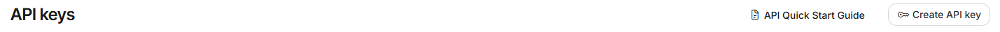
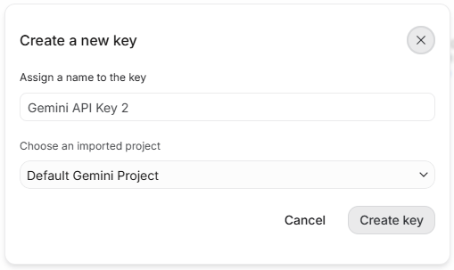
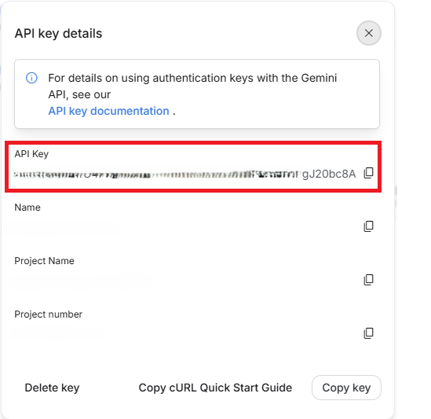
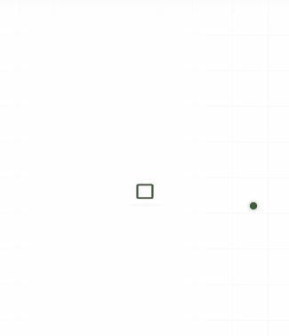
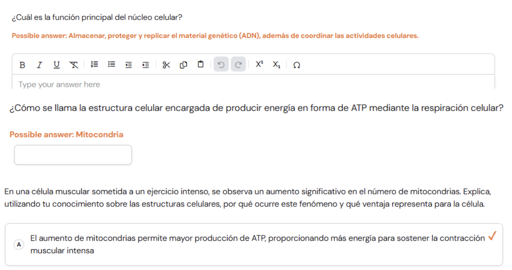
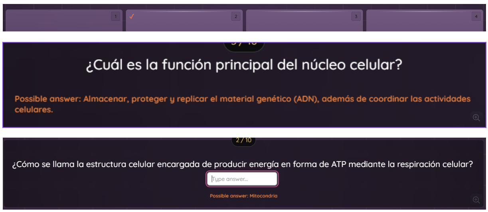
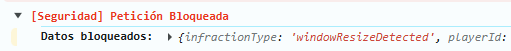
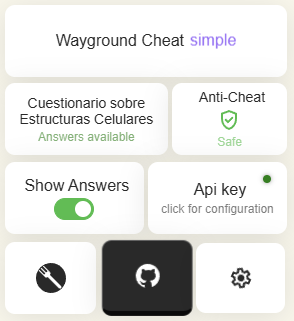
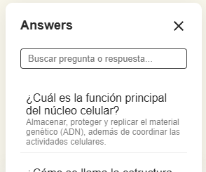

# Wayground Quizizz Cheat - AI Powered

**Wayground Cheat** is a high-performance userscript designed to enhance the experience on learning platforms. It focuses on intelligent automation and user privacy protection by intercepting and blocking network logs.

---

## Overview

The script is designed to keep the interface compact and consistent while retrieving answers from supported sources and maintaining a stable in-page experience. It also includes client-side protections that reduce noisy browser-state tracking.

> Note: AI-based answer retrieval can make mistakes. Review the output before relying on it.

> Note: The API key is stored locally in your browser and is only used to communicate with the selected provider.

---

## Key Features

* Automated answer retrieval from supported sources.
* Anti-tracking request filtering for selected network events.
* Focus protection that blocks forced fullscreen and related visibility checks.
* Restored selection, copy, and paste behavior in the page.
* Floating configuration panel with a minimal interface.
* Lightweight vanilla JavaScript implementation.

---

## Supported Modes

### Quizizz Modes
The script has been tested with the following quiz modes:

* Classic
* Test
* Mastery Peak
* Team mode

It has also been tested with several UI variants, including distraction-free layouts.

### Anti-Cheat Bypass

* Classic
* Test
* Mastery Peak
* Team mode

### Response Sources

* AI provider: the primary method for most quizzes.
* Official API: a fallback path that works only in specific cases such as `soloJoin` flows.

### Supported Question Types

* MCQ: supported by AI and API.
* BLANK: supported by AI and API.
* OPEN: supported by AI.

> Troubleshooting Tip: Alternative layouts and instructor-led presentation modes may not work reliably.

> Special complex case: Reorder, Match, and other less common formats are intentionally not covered to keep the script stable.

---

## AI Configuration

You must add and configure your own API key from the settings panel before requesting answers.

Currently supported provider:

* Gemini

Get your API key here: [Google AI Studio](https://aistudio.google.com/api-keys)

---

### How to Get a Gemini API Key

1. **Access Google AI Studio**
   Go to **Google AI Studio** and click the **Create API key** button in the top right corner.

   

2. **Configure and Generate**
   In the modal, assign a name to your key, select your project (e.g., *Default Gemini Project*), and click **Create key**.

   

3. **Copy Your Key**
   Once created, click **Copy key** to save your new API key to the clipboard for use in the script.

   

---

### Menu & UI

* **Color Customization:** Customize the menu accent and answer colors.
* **Toggle Answers:** Easily enable or disable answer displays.
* **AI Configuration:** Fine-tune AI response settings and provider options.
* **Status Indicators:** Integrated visual indicators for AI status and Anti-Cheat Bypass status.
* **Persistent Settings:** Automatically saves and retains your custom configuration.
* **Adaptive Theme:** Fully reactive UI that automatically adapts to dark and light web page themes.
* **Draggable Menu:** Reposition the floating menu anywhere on the screen for optimal placement.

| Menu |
| :---: |
|  |

---

## Screenshots

| In-Game Answers Test Mode | In-Game Answers | Blocked Logs |
| :---: | :---: | :---: |
|  |  |  |

| In-Game Menu Interface | In-Game Answers Interface |
| :---: | :---: |
|  |  |

---

## Installation

1. Install the [Tampermonkey](https://www.tampermonkey.net/) extension in your browser.
2. Install the script from Greasy Fork: [Install Wayground Stealth on Greasy Fork](https://greasyfork.org/es/scripts/577388-wayground-quizizz-cheat-show-answers-block-logs)
3. Open a Wayground session and the panel will appear automatically.

---

## Tech Stack

* JavaScript (ES6+) for core logic and DOM manipulation.
* CSS3 for the floating panel and visual styling.
* GPLv3 for the project license.

---

## Automatic Updates

This script was created for **educational and research purposes only**. The use of this script in real-world environments is the sole responsibility of the user. The author is not responsible for account suspensions or any misuse of this tool.

---

## Disclaimer

This script was created for **educational and research purposes only**. The use of this script in real-world environments is the sole responsibility of the user. The author is not responsible for account suspensions or any misuse of this tool.

---

   
  Developed by <a href="https://github.com/ByOscarPINE">ByOscarPINE</a>

